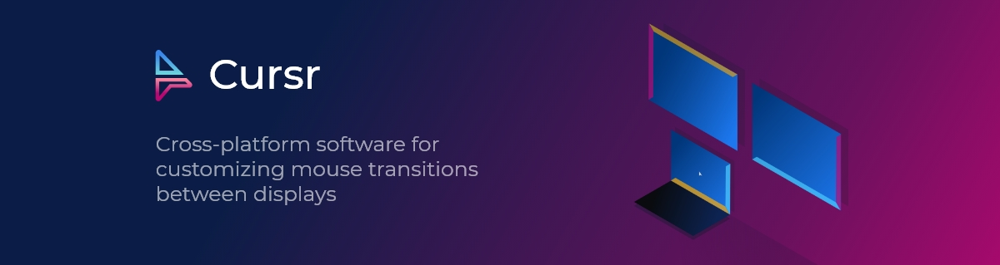

***Have ideas of features you would like to see in Cursr? [Let me know!](#support) Cursr development and priorities are driven by the needs of users!***

# Info

Cursr is a cross-platform utility application for optimizing mouse movements by creating custom links/portals between borders in a multiple display setup, but can also be useful to some with a single display setup. It was initially created to solve issue of mouse getting stuck on edges between 2 screens with different resolution as other existing solutions were not working as expected and/or did not provide nice user experience. Currently Cursr is being continuously developed to further improve and add ways of using mouse in more efficient ways, next major feature being Virtual KVM allowing to use one mouse and keyboard for multiple devices as well as share files and more.

Cursr is created and developed by a single developer full-time without any funding, therefore purchase of Cursr not only gives you access to advanced (Pro) features, but it also greatly supports the project and makes it sustainable for the developer to keep working on it full-time, meaning you'll get updates with new features and any bugs/issues fixed.

Available on Windows, OSX and Linux*

<small style="opacity:0.5">* Linux tested on Ubuntu (Gnome and KDE), on other distributions or desktop environments it will default to Ubuntu Gnome behavior and will probably not work. If you would like to see support for other distribution or desktop environment please create Github issue. </small>

# Support

For support, feature requests and discussions you can
* [Open an issue](https://github.com/bitgapp/Cursr/issues/new/choose) in this repository
* Leave a message in [Cursr Discord](https://discord.gg/jzuXJxYaHW) server
* Send email to contact@cursr.app

# Features  

## Current

* Create links between borders to allow mouse to move between them to:
  * Move mouse proportionally between different resolution screens
  * Move mouse faster between displays that are further apart by creating a link between their borders, instead of moving mouse across all screens in between
* Split border into smaller segments allowing you to move from one border to 2 or more displays
* Save setups for different display layouts and let Cursr auto-select best matching setup when application starts or layout changes
* Customize the UI by
  * Changing colors of linked borders and border segments

## Upcoming

<small style="opacity:0.5">Ordered with priority top to bottom:</small>

* Virtual KVM - Connect multiple devices using Cursr allowing you to create links between displays of connected devices, interchangeably use mouse and/or keyboard from either of the devices to control all connected devices, share files and keyboard, use touchpad gestures of the OS touchpad belongs too across all devices and more.
* Shortcuts to control cursor allowing you to create key bindings to move cursor to specific position on screen or completely control cursor/mouse with keyboard
* Cloud Sync - Sync your preferences and setups across all your devices instead of having to make changes or create setups from scratch on all devices

# Roadmap - What's next?

> The Roadmap migh be affected by any new issues/bugs if they will occur.

### Nearest month or two

My current work and priority is resolving any performance issues and optimizing Cursr application, as especially on OSX it tends to consume more CPU than it should. I'm planning to make a release with some if not all performance fixes by end of 2021 or at early start of 2022.

Create separate ARM build of macOS with M1 chip and create package build for Linux users.

Secondary/Background focus is improving SEO and discoverability of Cursr site, initially Cursr was not advertised or SEO optimized to first gather a small user base and resolve any bugs, as Cursr is now much more stable, I am working on improving it's discoverability and potentially marketing.

### First half of 2022

Add early subscription and most importantly Perpetual license (Lifetime access to purchased (and obviously free tier) features and updates to those features, but would not include features that come out later (after defined time - likely a year) of buying the license).

Virtual KVM for sharing mouse and keyboard, additional features like touchpad gesture usage across all devices, file sharing and other might come at later time depending on how much time it will take to develop mouse and keyboard sharing. KVM will also come with display identification graphics and potentially allow users to move display around in Cursr.

### Other

These might fit in at some point in first half of 2022 or would be done/looked into later in likely priority of top to bottom

* Make Cursr available on Mac App Store, Windows Store and Snap Store (Linux)
* Draw overlay/preview of borders, segments and links over the top of whole screens
* Allow to invert axis of the border/segment link, currently mouse position is only mapped from bottom to top and from left to right
* Cursor control shortcuts
* Cloud sync
* Allow changing display layout from withing the app instead of having to open display settings of the operating system
* Look into allowing to change/adjust cursor speed size on different resolution screens (seems to be mostly relevant to Linux users)
* If there will be enough interest/requests - open source free tier source code
